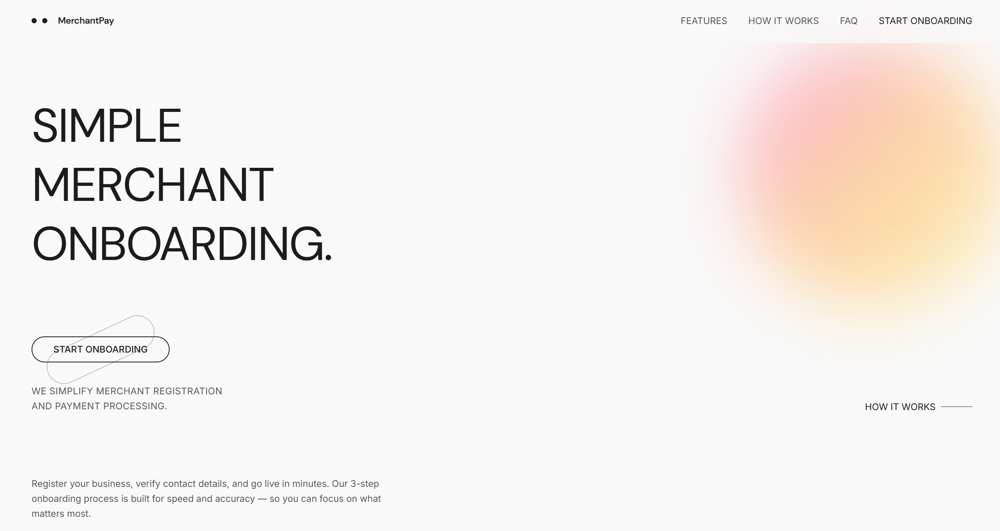
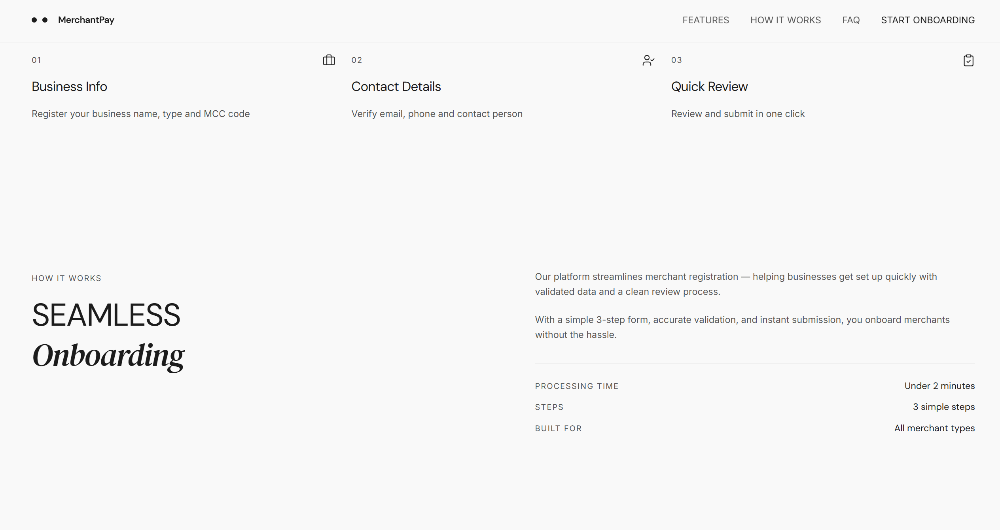
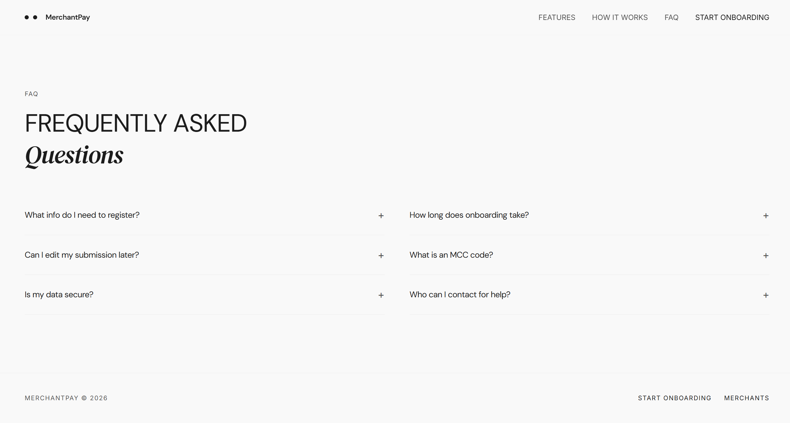
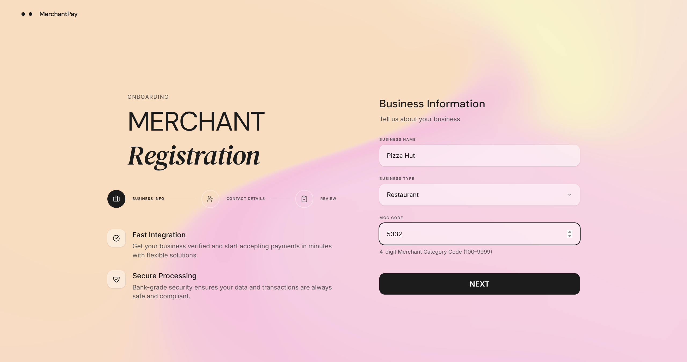
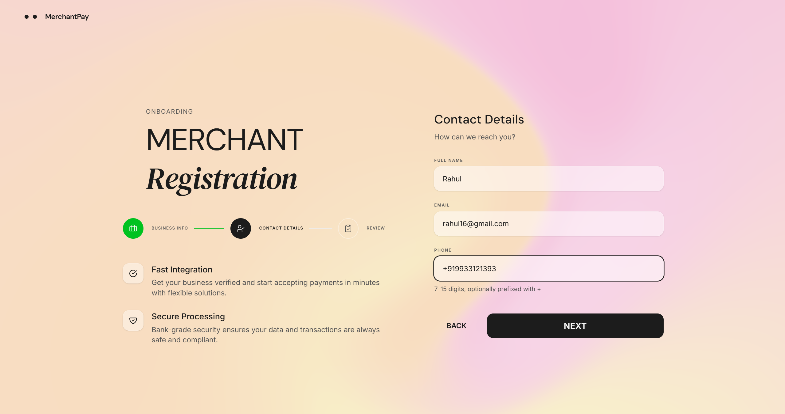
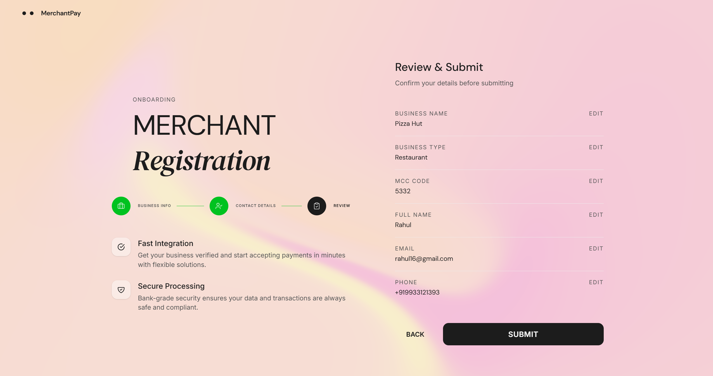
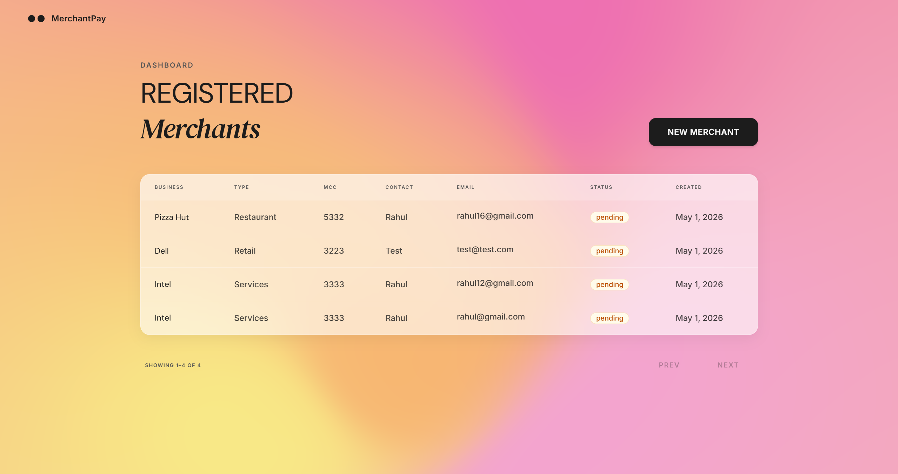

# Merchant Onboarding App

A full-stack merchant registration platform with a multi-step onboarding form, paginated merchant listing, and production-ready deployment.

**Live Demo:** [http://merchantpay.work.gd](http://merchantpay.work.gd)

<!-- Demo video — uncomment when ready
https://github.com/user-attachments/assets/YOUR_VIDEO_ID
-->

---

## Screenshots

### Landing Page


### Features & How It Works


### FAQ Section


### Onboarding — Step 1: Business Info


### Onboarding — Step 2: Contact Details


### Onboarding — Step 3: Review & Submit


### Merchant List


---

## Assignment Requirements

| # | Requirement | Status | Implementation |
|---|-------------|--------|----------------|
| 1 | Multi-step onboarding form | Done | 3-step wizard: Business Info, Contact Details, Review & Submit |
| 2 | Step 1 — Business Name, Type, MCC Code | Done | `StepBusinessInfo.tsx` with Zod validation |
| 3 | Step 2 — Contact Name, Email, Phone | Done | `StepContactInfo.tsx` with email/phone validation |
| 4 | Step 3 — Review all fields & submit | Done | `StepReview.tsx` with inline edit navigation |
| 5 | Merchant List page | Done | Paginated table with status badges, loading & error states |
| 6 | POST /merchants API | Done | Returns 201, validates with Pydantic v2, handles duplicates (409) |
| 7 | GET /merchants API | Done | Paginated with `limit`/`offset`, returns `total` and `has_more` |
| 8 | Data persistence (database) | Done | PostgreSQL 16 via SQLAlchemy async + Alembic migrations |
| 9 | README with setup instructions | Done | Docker one-command setup + manual setup guide |

---

## Tech Stack

### Backend
| Technology | Purpose |
|---|---|
| **Python 3.12** + **FastAPI** | Async web framework with automatic OpenAPI docs |
| **PostgreSQL 16** + **asyncpg** | Production-grade async database access |
| **SQLAlchemy 2.0** (async) | Type-annotated ORM with async session management |
| **Alembic** | Versioned database migrations |
| **Pydantic v2** | Request/response validation with custom error formatting |
| **structlog** | Structured JSON logging with request timing |

### Frontend
| Technology | Purpose |
|---|---|
| **React 19** + **TypeScript 6** | UI with strict type safety |
| **Vite 8** | Build tooling with HMR |
| **Tailwind CSS 4** + **shadcn/ui** | Utility-first styling with accessible components |
| **React Hook Form** + **Zod 4** | Performant forms with schema-based validation |
| **Framer Motion** | Page transitions and micro-animations |
| **TanStack Table** | Headless table for the merchant list |
| **Vitest** + **Testing Library** | Unit and component testing |

### Infrastructure
| Technology | Purpose |
|---|---|
| **Docker** + **Docker Compose** | Full-stack containerization (backend + frontend + PostgreSQL) |
| **Nginx** | Reverse proxy, SPA routing, static asset caching |
| **GitHub Actions** | CI pipeline — lint, type-check, and test on every push |
| **AWS EC2** | Production deployment (eu-west-1) |

---

## Getting Started

### Prerequisites

- Docker & Docker Compose **or** Python 3.12+ and Node.js 20+

### Option A: Docker (recommended)

```bash
git clone https://github.com/rahulthakore16/merchant-onboarding-app.git
cd merchant-onboarding-app
docker compose up --build
```

Visit [http://localhost](http://localhost) once all containers are ready. The backend API docs are at [http://localhost/docs](http://localhost/docs).

### Production on AWS Ubuntu with SSL

Use the AWS-specific compose file plus host Nginx and Certbot:

```bash
cp .env.aws.example .env.aws
docker compose --env-file .env.aws -f docker-compose.aws.yml up -d --build
```

Full instructions are in `deploy/aws-ubuntu-ssl.md`.

### Option B: Manual Setup

**1. Start PostgreSQL**
```bash
docker compose up -d postgres
```

**2. Backend**
```bash
cd backend
python -m venv venv
source venv/bin/activate   # Windows: venv\Scripts\activate
pip install -r requirements.txt
cp .env.example .env
alembic upgrade head
uvicorn app.main:app --reload --port 8000
```

**3. Frontend**
```bash
cd frontend
npm install
cp .env.example .env
npm run dev
```

The frontend runs at [http://localhost:5173](http://localhost:5173) and the API docs at [http://localhost:8000/docs](http://localhost:8000/docs).

### Seed Sample Data

```bash
cd backend
python -m seed
```

Inserts 5 sample merchants so the list page is populated on first load. Idempotent — skips if data already exists.

---

## API Endpoints

| Method | Path | Status | Description |
|--------|------|--------|-------------|
| `POST` | `/api/v1/merchants` | 201 | Register a new merchant |
| `GET` | `/api/v1/merchants` | 200 | List merchants (paginated) |
| `GET` | `/api/v1/merchants/{id}` | 200 | Get merchant by ID |
| `GET` | `/health` | 200 | Health check (uptime, DB status, version) |

### Pagination (GET /merchants)

| Param | Default | Range | Description |
|-------|---------|-------|-------------|
| `limit` | 20 | 1-100 | Items per page |
| `offset` | 0 | 0+ | Items to skip |

### Error Response Format

All errors follow a consistent structure:

```json
{
  "error": {
    "code": "VALIDATION_ERROR",
    "message": "Request validation failed",
    "details": [
      { "field": "body.email", "message": "value is not a valid email address" }
    ]
  }
}
```

Error codes: `VALIDATION_ERROR` (422), `DUPLICATE_MERCHANT` (409), `NOT_FOUND` (404), `INTERNAL_ERROR` (500).

---

## Running Tests

```bash
# Frontend — validation schemas and component tests
cd frontend
npm test

# Backend — integration tests (requires PostgreSQL)
docker exec -it merchant_db psql -U postgres -c "CREATE DATABASE merchant_test_db;"
cd backend
pytest -v
```

---

## Architecture & Design Decisions

### Backend — Layered Architecture

```
Request → Router → Service → Repository → Database
            ↓         ↓           ↓
        Validation  Business   SQL queries
        (Pydantic)   logic    (SQLAlchemy)
```

### Key Decisions

1. **Router / Service / Repository layers** — Separation of HTTP concerns, business logic, and data access for testability and maintainability.
2. **PostgreSQL + asyncpg** — Production-grade async database access with connection pooling.
3. **Alembic migrations** — Schema changes are versioned and reproducible across environments.
4. **Structured error responses** — Consistent `{"error": {...}}` format with field-level details for all error types.
5. **API versioning (`/api/v1/`)** — Forward-compatible API design that allows breaking changes in future versions.
6. **Cursor-based pagination** — Production APIs should never return unbounded result sets.
7. **UUID primary keys** — Non-enumerable, distributed-friendly identifiers.
8. **Merchant status field** — Domain-aware modeling (`pending`, `active`, `rejected`) beyond minimum requirements.
9. **Dual validation** — Zod schemas on the frontend mirror Pydantic schemas on the backend for defense-in-depth.
10. **Request logging middleware** — Every API call is logged with method, path, status, and duration for observability.

---

## CI/CD Pipeline

GitHub Actions runs on every push and pull request:

- **Backend:** Python 3.12 — linting with Ruff
- **Frontend:** Node 20 — TypeScript type checking, ESLint, Vitest unit tests

---

## Project Structure

```
backend/
├── app/
│   ├── main.py                    # FastAPI app, CORS, middleware, health check
│   ├── core/
│   │   ├── config.py              # Pydantic settings (env-based)
│   │   ├── database.py            # Async engine & session factory
│   │   ├── middleware.py          # Request logging middleware
│   │   ├── exceptions.py          # Custom exception classes
│   │   └── exception_handlers.py  # Global error handlers
│   ├── models/
│   │   └── merchant.py            # SQLAlchemy ORM model
│   ├── schemas/
│   │   ├── common.py              # Shared response schemas
│   │   └── merchant.py            # Merchant request/response schemas
│   ├── services/
│   │   └── merchant_service.py    # Business logic layer
│   ├── repositories/
│   │   └── merchant_repository.py # Data access layer
│   └── api/v1/
│       ├── router.py              # V1 router aggregator
│       └── merchants.py           # Merchant endpoints
├── alembic/                       # Database migrations
├── tests/                         # Integration tests
├── seed.py                        # Sample data seeder
├── requirements.txt
└── Dockerfile

frontend/
├── src/
│   ├── components/
│   │   ├── landing/               # Landing page sections (Hero, Features, FAQ)
│   │   ├── onboard/               # Multi-step form (StepBusinessInfo, StepContactInfo, StepReview)
│   │   ├── ui/                    # shadcn/ui primitives (Button, Input, Badge, etc.)
│   │   └── ErrorBoundary.tsx      # Global error boundary
│   ├── hooks/
│   │   └── useMerchants.ts        # Merchant list data fetching with pagination
│   ├── lib/
│   │   ├── api.ts                 # Axios instance with base URL
│   │   └── validators.ts          # Zod schemas for form validation
│   ├── pages/
│   │   ├── LandingPage.tsx        # Marketing landing page
│   │   ├── OnboardPage.tsx        # 3-step onboarding wizard
│   │   └── MerchantsPage.tsx      # Paginated merchant table
│   └── types/
│       └── merchant.ts            # TypeScript interfaces
├── nginx.conf                     # Reverse proxy + SPA config
├── Dockerfile                     # Multi-stage build (Node → Nginx)
└── package.json

.github/workflows/ci.yml           # CI pipeline
docker-compose.yml                  # Full-stack orchestration
```

---

## Next Steps

If this were a production system, the following enhancements would be prioritized:

1. **Authentication & Authorization** — JWT-based auth with role-based access control.
2. **Rate Limiting** — Per-IP and per-endpoint rate limits to prevent abuse.
3. **E2E Tests** — Playwright tests covering the full onboarding flow.
4. **Monitoring & Alerting** — APM with structured log aggregation (e.g., Datadog, Grafana).
5. **Merchant Status Workflow** — Admin interface to review, approve, or reject pending merchants.
